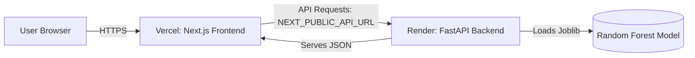

# Hosting Guide: ChurnGuard

To host this project, we recommend deploying the **Next.js frontend to Vercel** and the **FastAPI backend to Render** (or Heroku). 

---

## 1. Hosting the Backend (FastAPI on Render)

1. **Sign up / Log in** to [Render](https://render.com/).
2. Click **New +** and select **Web Service**.
3. Connect your GitHub repository (`sarcaxticlarka/churn_rate_predictor`).
4. **Configuration Details**:
    * **Name**: `churnguard-backend` (or similar)
    * **Root Directory**: `backend` (Important: Specify this so Render only builds the Python code)
    * **Environment**: `Python 3`
    * **Build Command**: `pip install -r requirements.txt`
    * **Start Command**: `uvicorn main:app --host 0.0.0.0 --port $PORT`
5. Click **Create Web Service**.
6. Wait for the build to finish. Once live, copy the public URL (e.g., `https://churnguard-backend.onrender.com`).

---

## 2. Hosting the Frontend (Next.js on Vercel)

1. **Sign up / Log in** to [Vercel](https://vercel.com).
2. Click **Add New** -> **Project**.
3. Import your GitHub repository (`sarcaxticlarka/churn_rate_predictor`).
4. **Configuration Details**:
    * **Project Name**: `churnguard`
    * **Framework Preset**: `Next.js`
    * **Root Directory**: `frontend` (Important: Click Edit and select the `frontend` folder)
5. **Environment Variables**:
    * Open the Environment Variables tab.
    * **Name**: `NEXT_PUBLIC_API_URL`
    * **Value**: *Paste the Render Backend URL here* (e.g., `https://churnguard-backend.onrender.com`)
6. Click **Deploy**.
7. Vercel will build the frontend and link it to your newly hosted backend API.

---

## Architecture Diagram (Production)



If you encounter any CORS issues after deploying, verify that the `allow_origins=["*"]` or your specific Vercel URL is permitted in `backend/main.py`. Currently, it allows localhost:3000, so you should update it for production:
```python
# In backend/main.py
app.add_middleware(
    CORSMiddleware,
    allow_origins=["*"], # Or your specific Vercel URL
    allow_credentials=True,
    allow_methods=["*"],
    allow_headers=["*"],
)
```
